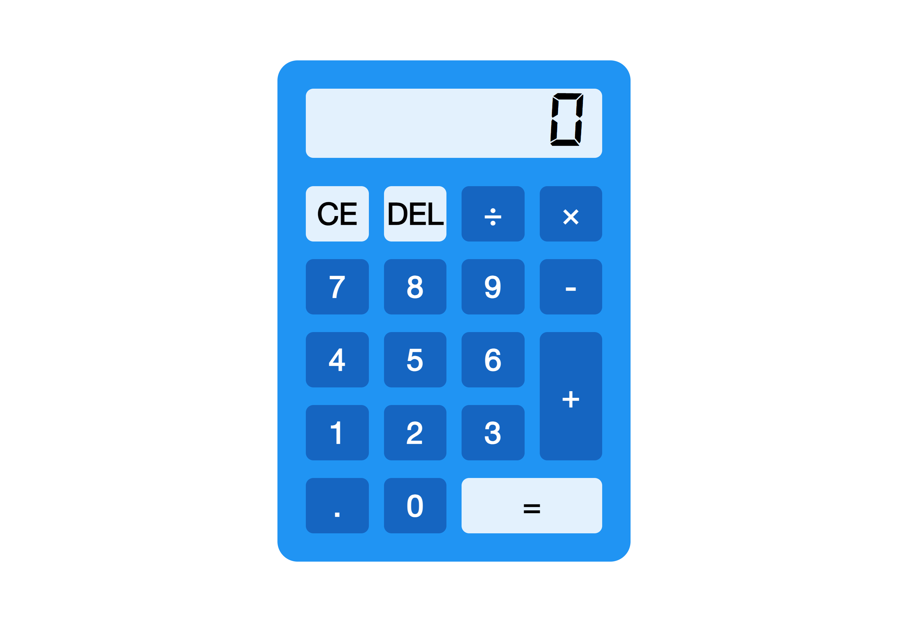

# CodSoft - Calculator App

## Table of contents

- [CodSoft - Calculator App](#codsoft--calculator-app)
  - [Table of contents](#table-of-contents)
  - [Overview](#overview)
    - [The challenge](#the-challenge)
    - [Screenshot](#screenshot)
    - [Links](#links)
    - [Built with](#built-with)
  - [Author](#author)

## Overview

### The challenge

Users should be able to:

- See the size of the elements adjust based on their device's screen size
- Perform mathmatical operations like addition, subtraction, multiplication, and
  division

### Screenshot

.png>)

### Links

- Solution URL: (https://github.com/Ikenna04/codsoft-taskno-3)
- Live Site URL: (https://ikenna04.github.io/codsoft-taskno-3/)

### Built with

- Semantic HTML5 markup
- CSS custom properties
- Flexbox
- CSS Grid
- Mobile-first workflow

## Author

EZEORAH IKENNA PASCHAL

- Twitter - [@ikenna004](https://www.twitter.com/ikenna004)
